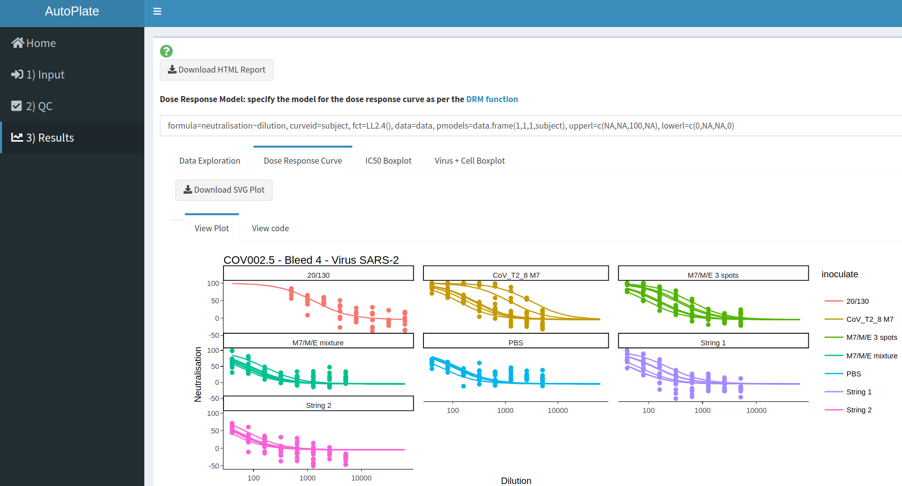

# AutoPlate

<!-- 
 
-->

## Introduction

[AutoPlate](https://philpalmer.shinyapps.io/AutoPlate/) is an [R Shiny web application](https://shiny.rstudio.com/) (and UI) that helps you automate the analysis of biological assays conducted on 96-well plates. It lets you go from raw data to publication ready figures in minutes!

Currently, the only supported assay type is the [Pseudotype Micro Neutralisation (pMN) assay](https://www.ncbi.nlm.nih.gov/pmc/articles/PMC6526431/), for which dose-response curves can be fit. In the future, other assays such as ELLA, ELISA, HIA or even any custom assay may be supported. Let us know if there's an assay that you would like us to support!

## Getting started

### Check it out

Try out the app here: https://philpalmer.shinyapps.io/AutoPlate/

Currently the dashboard contains the following tabs and features, which allow you to run an analysis in three simple steps:

- :house: **Home** 

    The opening page gives an introduction to AutoPlate and contains useful links for support and this GitHub repository

       

- :arrow_right: **1) Input** 

    Upload the raw plate readouts for your 96 well-plates and specify what each well contained in terms of dilutions, samples, types, bleed, inoculate, primary and study

        
    
- :heavy_check_mark: **2) Quality Control**  

    Visualise the data you entered in step 1 and check that the controls have worked for each plate/well. If the controls have failed for any wells these can be excluded from the analysis

        

- :chart_with_upwards_trend: **3) Results**  

    Analyse the data and generate downloadable plots such as a Dose Response Curve
    
       

### Installation

## Credit

This app was built by [@PhilPalmer](https://github.com/PhilPalmer) while at the University of Cambridge [Lab of Viral Zoonotics](https://www.lvz.vet.cam.ac.uk/)

Many thanks to other who have helped out along the way too, including (but not limited to): David Wells, George Carnell, Joanne Marie Del Rosario and Kelly da Costa 

## Citation