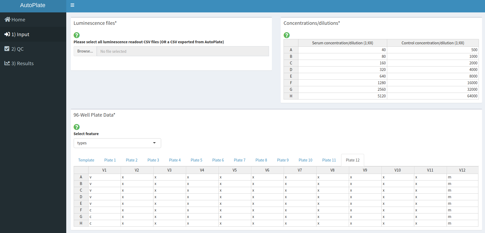
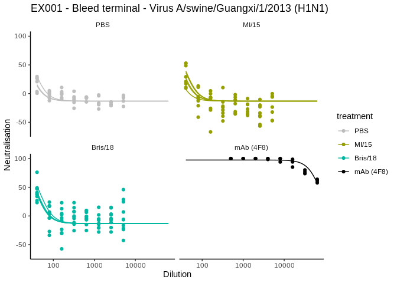

<!-- README.md is generated from README.Rmd. Please edit that file -->

# AutoPlate 

<!-- badges: start -->


[](https://www.tidyverse.org/lifecycle/#experimental)
[](https://codecov.io/gh/PhilPalmer/AutoPlate)
[](https://github.com/PhilPalmer/AutoPlate/actions)
<!-- badges: end -->

## Introduction

[AutoPlate](https://philpalmer.shinyapps.io/AutoPlate/) is an [R Shiny
web application](https://shiny.rstudio.com/) (and R library) that helps
you automate the analysis of biological assays conducted on 96-well
plates. It lets you go from raw data to publication ready figures in
minutes\!

Currently, the only supported assay type is the [Pseudotype Micro
Neutralisation (pMN)
assay](https://www.ncbi.nlm.nih.gov/pmc/articles/PMC6526431/), for which
dose-response curves can be fit. In the future, other assays such as
ELLA, ELISA, HIA or even any custom assay may be supported. Let us know
if there’s an assay that you would like us to support\!

You can use AutoPlate in two ways: 
1. [**Web application**](#check-out-the-web-application) - this is the easiest way to run AutoPlate\!
2. [**R library**](#using-the-r-library) - you can just use the functions you need for your own analysis\!

## Check out the web application

Try out the app here: <https://philpalmer.shinyapps.io/AutoPlate/>

Currently the dashboard contains the following tabs and features, which
allow you to run an analysis in three simple steps:

  - :house: **Home**
    
    
    The opening page gives an introduction to AutoPlate and contains
    useful links for support and this GitHub repository
    
    <br /> <br /><br /><br />

  - :arrow_right: **1) Input**
    
    
    Upload the raw plate readouts for your 96 well-plates and specify
    what each well contained in terms of dilutions, samples, types,
    bleed, treatment, virus and experiment ID
    
    <br /> <br /><br /><br />

  - :heavy_check_mark: **2) Quality Control**
    
    
    Visualise the data you entered in step 1 and check that the controls
    have worked for each plate/well. If the controls have failed for any
    wells these can be excluded from the analysis
    
    <br /> <br /><br /><br />

  - :chart_with_upwards_trend: **3) Results**
    
    
    Analyse the data and generate downloadable plots such as a Dose
    Response Curve
    
    <br /> <br /><br /><br />

### Run your own version of the web application

1.  Get the source code from GitHub:

<!-- end list -->

``` bash
git clone https://github.com/PhilPalmer/AutoPlate.git
cd AutoPlate
```

2.  See [`app.R`](app.R) for how you can run you own version of the app
    yourself locally

Once you’ve loaded the library you can run AutoPlate like so:

``` bash
RScript app.R
```

## Using the R library

### Installation

You can install the latest released version of autoplate from
[GitHub](https://github.com/) with:

``` r
# install.packages("devtools")
devtools::install_github("PhilPalmer/AutoPlate")
```

``` r
library(autoplate)
```

    #> Loading autoplate
    #> Loading required package: magrittr

### Running your own analysis in R

AutoPlate was primarily built as a web app but most of the functionality
can also be run within R, which may be useful if you want to customise
an analysis.

Here is a basic example of how to plot a dose response curve from the
data exported from AutoPlate:

1)  Load your dataset

<!-- end list -->

``` r
# Load an example dataset
data("pmn_platelist_H1N1_example_data")
data <- pmn_platelist_H1N1_example_data

# OR

# Load your own dataset - make sure your file path is correct!
platelist_file <- "data-raw/pmn_platelist_H1N1_example_data.csv"
data <- read.csv(platelist_file, header=TRUE, stringsAsFactors=FALSE, check.names=FALSE)
```

2)  Define the virus you want to plot

<!-- end list -->

``` r
virus_to_plot <- unique(data$virus)[1]
print(virus_to_plot)
#> [1] "A/swine/Guangxi/1/2013 (H1N1)"
```

3)  Preprocess your dataset to keep only the non-excluded, `types` and
    `virus` of interest:

<!-- end list -->

``` r
 data <- dplyr::filter(data, types %in% c("x", "m"), exclude == FALSE, virus == virus_to_plot)
```

4)  Fit your dose-response model (DRM) using the DRC package:

<!-- end list -->

``` r
model <- drc::drm(formula=neutralisation~dilution, curveid=sample_id, fct=drc::LL2.4(), data=data, pmodels=data.frame(1,1,1,sample_id), upperl=c(NA,NA,100,NA), lowerl=c(0,NA,NA,0))
```

5)  Plot your dose-response curve with AutoPlate and ggplot2 (Optional:
    make it intereactive with Plotly\!)

<!-- end list -->

``` r
drc_plot <- autoplate::plot_drc(data, model)
drc_plotly <- plotly::ggplotly(drc_plot)
#> Warning: `group_by_()` is deprecated as of dplyr 0.7.0.
#> Please use `group_by()` instead.
#> See vignette('programming') for more help
#> This warning is displayed once every 8 hours.
#> Call `lifecycle::last_warnings()` to see where this warning was generated.
print(drc_plot)
```



## Credit

This app was built by [@PhilPalmer](https://github.com/PhilPalmer)
while at the University of Cambridge [Lab of Viral
Zoonotics](https://www.lvz.vet.cam.ac.uk/)

Many thanks to others who have helped out along the way too, including
(but not limited to): David Wells, George Carnell, Joanne Marie Del
Rosario and Kelly da Costa


## Citation

AutoPlate is yet to be published but we’re hoping to change this soon\!
