```{r, include = FALSE}
knitr::opts_chunk$set(
  collapse = TRUE,
  comment = "#>"
)
```

See the [Quick Start](../index.html#web-application-quick-start)

The AutoPlate web interface consists of three simple steps.
Once you have input your data in Step 1 you will need to click on Steps 2 (QC) or Step 3 (Results) to continue the analysis.
It is possible to return to previous steps or skip ahead at any given point.

## 1) Input

Upload your luminescence rawdata from the plate reader and specify any metadata required for dose-response curve analysis.

### 1.1) Select the assay type
Select the type of assay which you wish to analyse data for, currently supported assays are `pMN` and `ELLA`


### 1.2) Upload your luminescence files. 
Upload your luminescence files directly from the plate reader or try out the app using example data. 
Holding down `Shift` or `Ctrl` should allow you to select multiple plates.

*Note: the uploaded files must correspond to the selected assay type*

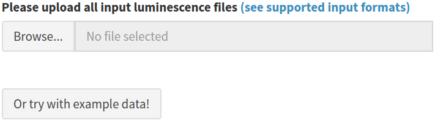

#### Supported Input Formats

Luminescence files that contain the raw luminescence values for each well can be uploaded directly from the plate reader.
CSV format is used for the [pMN assay](#pmn-csv-plate) and Excel format for the [ELLA assay](#ella-excel-plate). Users can also upload a previously exported CSV file generated from a later step in [AutoPlate](#autoplate-csv-plates) if they want to re-load a dataset that has already been analysed.

##### 1) pMN CSV plate

|                   |               |
| ----------------- | ------------- |
| Description       | CSV input from a plate reader used for the pMN assay |
| Format            | CSV  |
| Extension         | `.csv`  |
| Example           | [`example_data_pmn_plate_n1.csv`](https://github.com/PhilPalmer/AutoPlate/blob/main/data-raw/example_data_pmn_plate_n1.csv) | |
| Required columns  | `WellPosition`, `RLU` |
| Plate number      | The end of the filename can be used to specify the filename eg `1.csv` for plate 1. If numbers are not provided the filename will be used instead |
| Number of files   | One CSV file per plate. Multiple files can be uploaded |


##### 2) ELLA Excel plate

|                   |               |
| ----------------- | ------------- |
| Description       | Excel input from a plate reader used for the ELLA assay |
| Format            | Excel  |
| Extension         | `.xls`, `xlsx` |
| Example           |  |
| Required columns  |  |
| Plate number      | The end of the filename can be used to specify the filename eg `1.xls` for plate 1. If numbers are not provided the filename will be used instead |
| Number of files   | One Excel file per plate. Multiple files can be uploaded |


##### 3) AutoPlate CSV plates

|                   |               |
| ----------------- | ------------- |
| Description       | CSV input downloaded from AutoPlate on the QC page generated from one of the two previous input files |
| Format            | CSV  |
| Extension         | `.csv`  |
| Example           | [`example_data_pmn_platelist_H1N1.csv`](https://github.com/PhilPalmer/AutoPlate/blob/main/data-raw/example_data_pmn_platelist_H1N1.csv) |
| Required columns  | `types`, `sample_id`, `dilution`, `bleed`, `virus`, `rlu`, `neutralisation`, `treatment`, `experiment_id`, `exclude`, `plate_number` |
| Plate number      | The plate number will be specified in the `plate_number` column |
| Number of files   | One CSV file which can correspond to multiple plates  |

##### Description of all columns
```{r, echo=FALSE, layout="l-body-outset"}
column_descriptions_filepath <- "../data-raw/example_data_column_descriptions.csv"
example_data_column_descriptions <- utils::read.csv(column_descriptions_filepath,
  header=TRUE,
  stringsAsFactors=FALSE,
  check.names=FALSE
)
knitr::kable(example_data_column_descriptions)
```

### 1.3) Specify your dilutions

Both the serum and control concentration/dilutions can be specified by an interactive table, containing default values. 
The Serum concentrations/dilutions correspond to wells of type `x` and the control concentrations/dilutions correspond to wells of type `m`.

The **pMN** assay uses **vertical dilutions** so any updates made to the dilutions table will update all wells of the relevant type (`x` or `m`) which are on the same row eg `A`

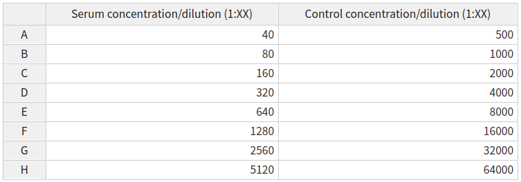

The **ELLA** assay uses **horizontal dilutions** so any updates made to the dilutions table will update all wells of the relevant type (`x`) which are on the same column eg `1`

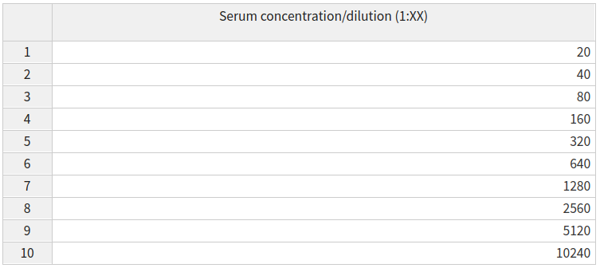

Alternatively, any custom modifications to the dilutions can be set in the [plate data table](#update-the-plate-data-table) and modifications for all plates can be easily set on the [template tab](#template-tab)

### 1.4) Update the plate data table

Data for [any feature](#description-of-all-columns) can be entered by selecting that feature from the dropdown menu and entering the data using the plate data table. 
The most important features to ensure that they are set correctly using the plate data table are the `types`, `sample_id` and `dilution`.

All three of these features will have default values:

- `sample_id` - the sample IDs will automatically increment both across and between plates

- `dilution` - the default dilutions will be defined by the [dilutions table](#specify-your-dilutions). These can be modified either per plate or for all plates using the [template tab](#template-tab)

- `types` - will have a default plate layout (shown and described below). This can be updated for all plates using the [template tab](#template-tab)

Most wells are type `x` (experimental); these are a known dilution of sample neutralising the virus of interest. Type `m` indicates the positive control (`m` was originally for monoclonal antibodies), these wells are treated the same as type `x` but can be easily filtered or coloured differently and may be diluted differently. The final types are `v` and `c` which are used to convert virus marker measurements into neutralisation and normalise the data. Type `c` contains cells only and represents 100% neutralisation because there is no virus to enter cells and express the marker. Type `v` contains cells and virus-only but (no treatment) and represents 0% neutralisation because no virus neutralisation occurs.

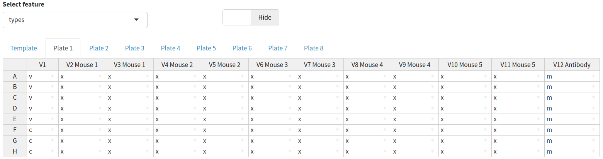

It may also be useful to `exclude` wells from the analysis, for example, if the controls have not worked. 
Wells can be excluded by selecting exclude from the dropdown menu and ticking any wells you wish to remove from the analysis.

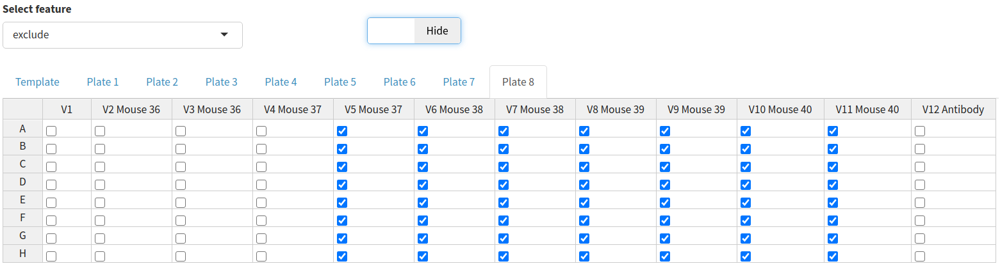

There is also an option to show the raw RLU values for a given plate by clicking the toggle button above the plate data table.

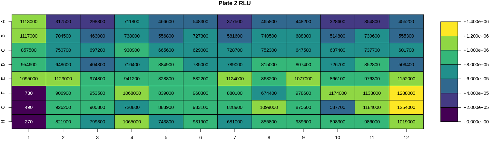


##### Template tab

Any modifications made to the template tab will update the selected feature for all plates. 
For example, this may be useful to set a different `types` plate layout if yours differs from the default one.

### 1.5) Other features

Features such as the `virus`, `treatment`, `bleed` and `experiment_id` can be set by the [plate date table](#update-the-plate-data-table).
However, the values for these features will often be the same for many wells and so it may be time-consuming to specify them for each individual well.
Therefore, in the "other features" section these features can be set based on any other existing feature.

For example, if I want to specify the `treatment` that each sample was inoculated with you can select `sample_id` from the dropdown menu.
This will then display a table of all samples and you can specify the treatment (eg vaccine) used for each sample.

The default value in the dropdown menu is for each `well`. Meaning that AutoPlate will update the selected tab (eg `virus`) for all wells on all plates.

*NOTE: Make sure you click `Submit` once you have entered all the information for the selected feature*

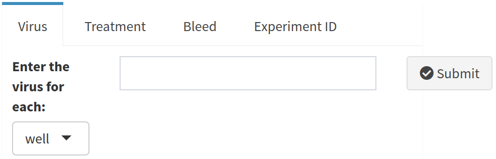

To help prevent you from forgetting to add information for these features, AutoPlate displays a table showing which features it has data for. 
In the following table no information has been entered for either the `virus`, `treatment`, `bleed` or `experiment_id`
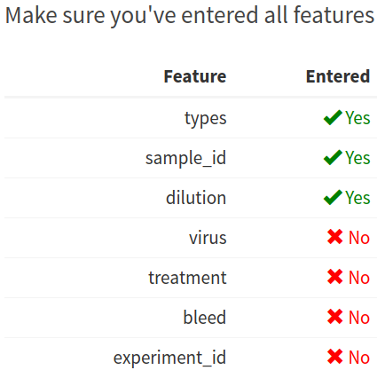


## 2) Quality Control 

Visualise the data you entered in step 1 and check that the controls have worked for each plate/well

*Note: If you notice any issues with the data at the QC step it is possible to return to step 1 to correct the data entered for any feature*

### 2.1) Average luminescence table

The table displaying the average viral and cell luminescence can be used to check that there is a substantial difference in the average luminescence between virus-only and cell-only wells and that an adequate number of control wells have been included in the analysis

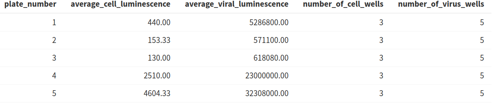

### 2.2) Heatmaps

Heatmaps are generated for various key features (well types, sample ID, dilution, virus, RLU, neutralisation, treatment, bleed and experiment ID). For all these features a heatmap is used to show the value for each of these features for all plates in a 96-well plate format i.e., an 8 x 12 grid to check that the values have been entered correctly

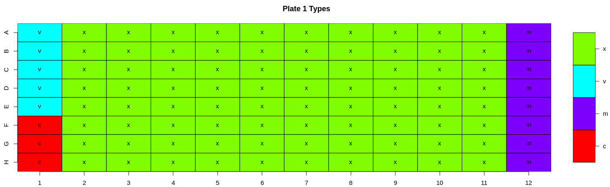

### 2.3) Types boxplot

A boxplot of all the different well types for each plate is generated. This plot can be used to check differences in control values between plates. It is important to check that the virus wells have approximately the highest luminescence and cell wells have the lowest because it is these wells that are used for the normalisation when calculating the neutralisation. In our experience, if the virus- only wells do not have the highest values on a plate, the dose-response curves estimated from that plate are shifted downwards, and this may underestimate the neutralising capacity of the sample sera.

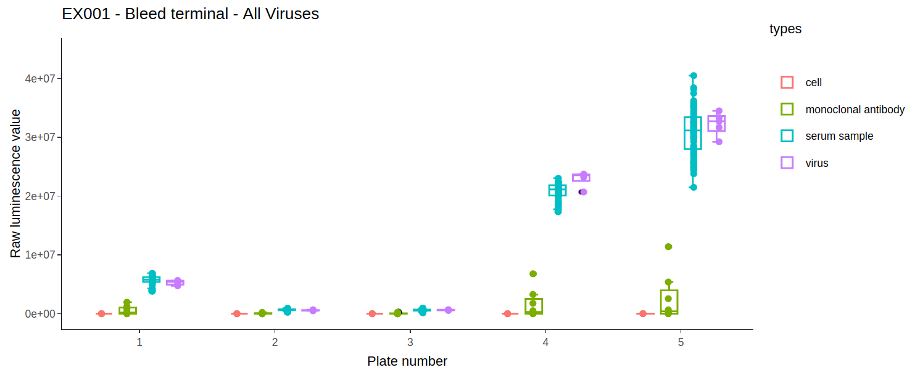

### 2.4) Excluding wells

A user can choose to exclude any wells from the analysis. To do this they can specify a string consisting of comma-separated values of either whole plates, individual wells or a range of wells. Wells can also be excluded from the [plate data table](#update-the-plate-data-table) in the input step. Wells could be excluded for any number of reasons but are most commonly excluded when the controls have failed or when wells were left empty on a particular plate. A heatmap is also generated to show which wells will be excluded from the analysis, allowing users to verify that the correct wells have been excluded from the analysis.

To exclude wells from the analysis you can enter any combination of the following separated by commas:

- whole plates - by number, eg: `1,2,3`

- individual wells - by their plate number, row and column, eg: `1A1,1D6,3H12`

- range of wells - by their plate numbers, rows and columns, eg: `1A1:A12,2B6:H12`

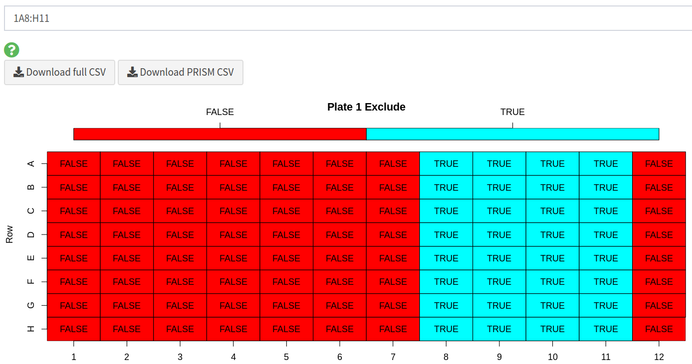

### 2.5) Downloading full CSV data

Users can export the formatted dataset containing all assay data as a CSV from AutoPlate ([see an example of the format](https://github.com/PhilPalmer/AutoPlate/blob/main/data-raw/example_data_pmn_platelist_H1N1.csv)).
This allows the data to be shared or analysed with different statistical software. This dataset can also be uploaded in [step 1.2](#upload-your-luminescence-files-) of AutoPlate so that shared data can be analysed in AutoPlate or old data can be reanalysed.

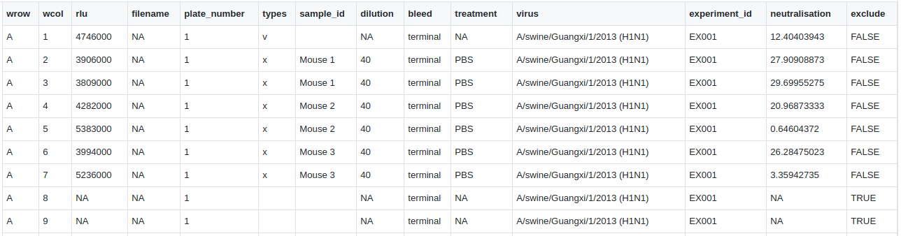

### 2.6) Downloading PRISM CSV data

Data can also be downloaded in CSV a format displaying the neutralisations such that it can easily be loading into and plotted in [GraphPad PRISM](https://www.graphpad.com/scientific-software/prism/)

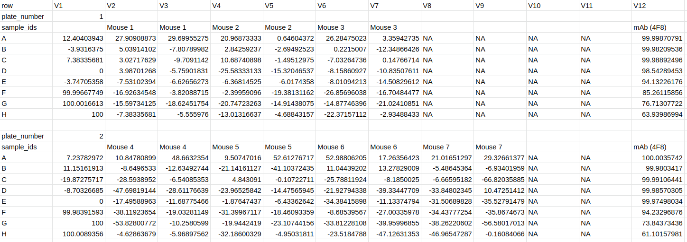

## 3) Results

Fit dose-response curves to analyse the data entered in previous steps, calculate the IC50 values and generate plots to visualise the results.

Four plots are generated on the results page.
Each of the interactive plots can be viewed, downloaded (in SVG or PNG format), reproduced in R using the displayed code and customised with various options such as the plot text size.

### 3.1) Data exploration plot

The data exploration plot fits a loess smooth to each treatment group to illustrate the dose-response relationship of treatment groups outside of the dose-response curve model

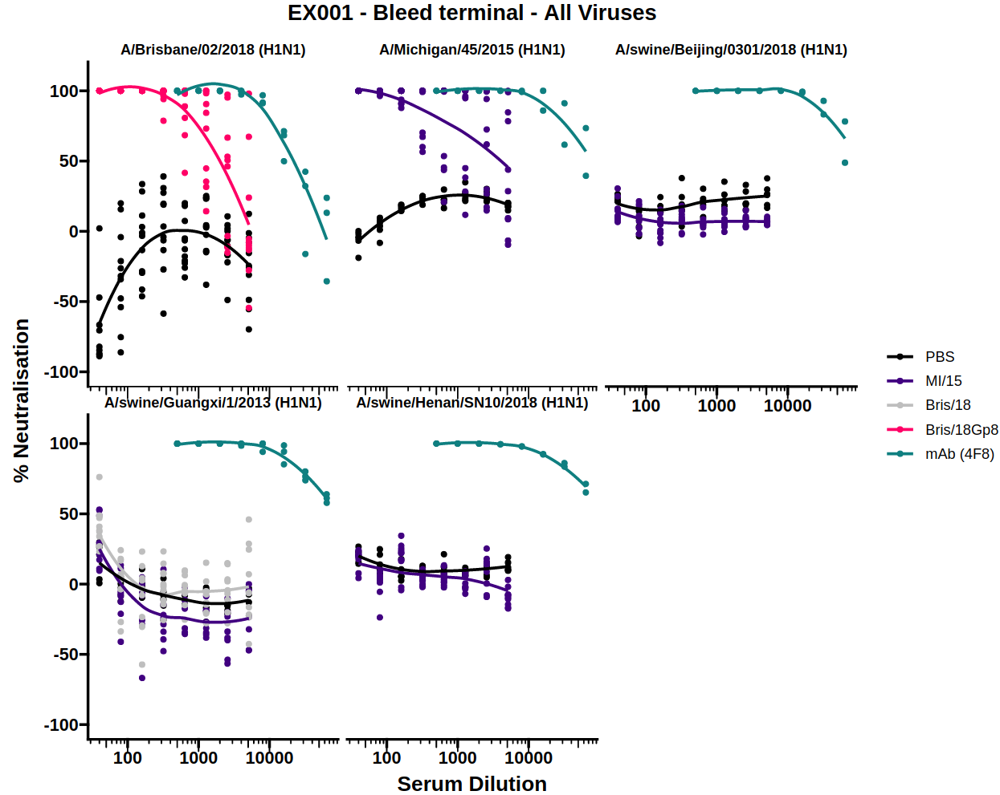

### 3.2) Dose-response curve (DRC)

By measuring neutralisation along a dilution series, a dose-response curve (DRC) can be estimated for a given antibody/sera. When this dilution is displayed on a log scale the curve follows a classic S shape which is well represented by the 4-parameter log-logistic regression curve (the default for AutoPlate).

The [dose-response model (DRM)](#dose-response-model-drm) will be fit to the treatments for each of the viruses independently.
The DRC(s) for each virus can be displayed by selecting the virus from the dropdown menu.

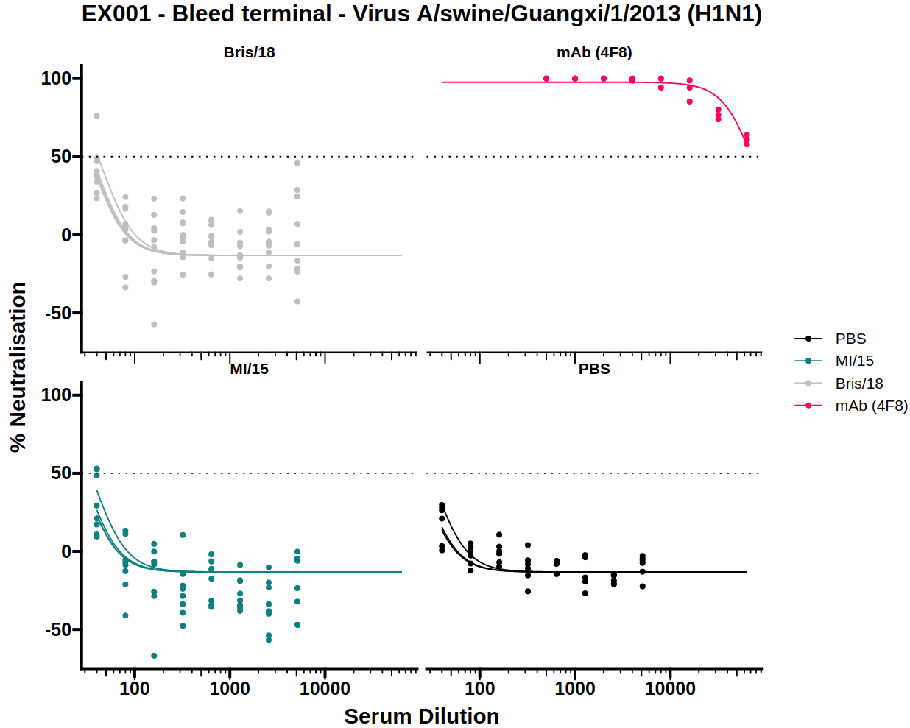

### 3.3) IC50 boxplot

Neutralisation potency is usually reported as the IC50 of a dose-response curve.
To simplify visual comparison of treatments a boxplot of just the IC50 values of each curve is displayed.

The [dose-response model (DRM)](#dose-response-model-drm) will be fit to the treatments for each of the viruses independently.
The IC50 boxplots for each virus can be displayed by selecting the virus from the dropdown menu.

There is also an option to toggle the boxplot between a scatter plot and boxplot. The scatter plot option may be useful to see the underlying data points when there are very few samples.

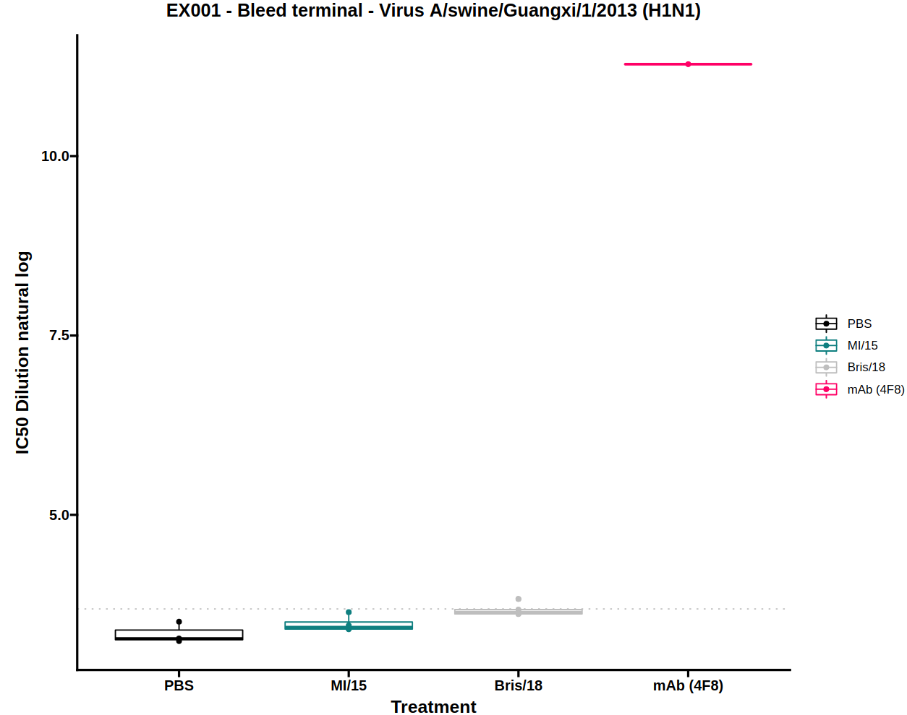

#### Download individual effective dose (IED) table

A table containing all of the IC50 values for each sample can be downloaded in CSV format from the IC50 boxplot tab.

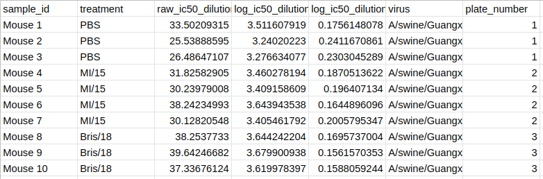

### 3.4) Virus-cell boxplot

The virus-cell boxplot can be used to check that the controls have worked as expected. There should be a clear separation between the virus and cell groups and little variation between plates.

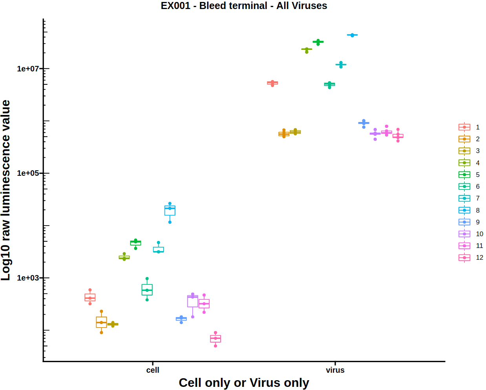

### 3.5) Download the report

All the information displayed within AutoPlate, such as the quality control and results plots can be downloaded as a shareable HTML report file. As well as including all the plots generated in AutoPlate, it also contains the specific code and R package versions needed to reproduce them.

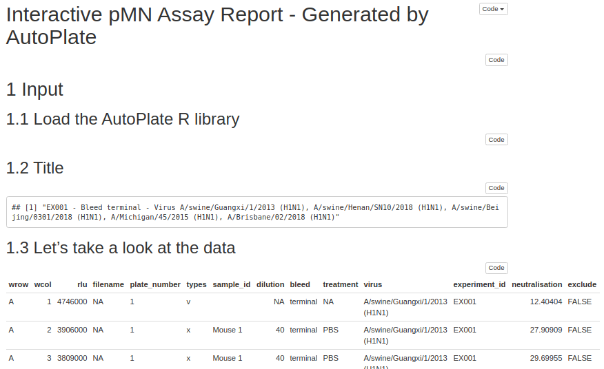

### 3.6) Dose-response model (DRM)

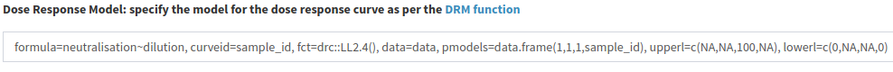

The dose-response model (DRM) is the model that is fit to your data for each virus in order to generate the dose-response curve(s) and IC50 boxplot(s).
The model is defined and fit using the R package [drc](https://cran.r-project.org/web/packages/drc/drc.pdf).
Defining the model allows a great deal of flexibility as the equation, model type, which parameters are shared between treatment groups and any upper/lower limits for the parameters can all be modified.

By default, for the dose-response model, the dose is the `dilution`, and the `neutralisation` is the response, the sample IDs are used to group the data. The model used is the four-parameter log-logistic function (or [LL2.4](https://www.rdocumentation.org/packages/drc/versions/2.5-12/topics/LL.4)) which can be denoted by the expression below, where b is the slope around the IC50, c is the curve minimum, d is the curve maximum and e is the log IC50 value. This model was chosen as the default option because we found that models more readily converge when estimating log(IC50) than IC50 itself. By default, a single curve minimum, curve maximum, and gradient is estimated for the whole population to improve comparisons between samples. The upper limit of the curve maximum is set to 100 and the lower limit for the gradient around the IC50 and the IC50 value are set to zero to prevent a negative gradient or IC50 value.

$$
f(x)=c+\frac {d - c}{1 + exp(b(log(x) - e))}
$$

If you wish to customise the DRM, [read more here](https://www.rdocumentation.org/packages/drc/versions/2.5-12/topics/drm)

